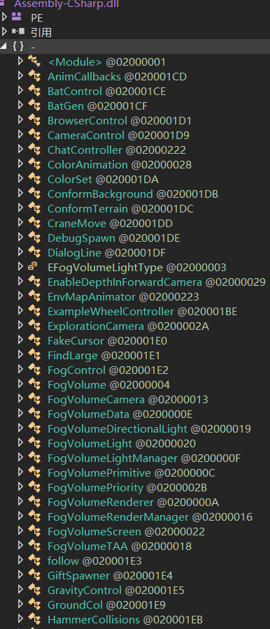

# GettingOverIt 魔改

标签（空格分隔）： 修改 锤子

---

## 材料准备 ##
1. Getting Over It 游戏一份 [百度云下载(仅供研究)  https://pan.baidu.com/s/14Ha1xhEtaNtTbfpoLaTnYQ 密码: n4y9](https://pan.baidu.com/s/14Ha1xhEtaNtTbfpoLaTnYQ#n4y9)
2. dnspy一份 [dnspy构建版本下载](https://ci.appveyor.com/project/0xd4d/dnspy/branch/master/artifacts)
3. 能运行上面两个的电脑一台
4. 一个会基本的dnspy操作的人一位

## 正戏 ##
1. 检查Getting Over It
    看到Managed下一堆UnityEngine相关的东西,Unity3D引擎作品无疑

    用dnspy打开`GettingOverIt_Data/Managed/Assembly-CSharp.dll`看看,很好,没加密
    
2. 修改Assembly-CSharp.dll
    1. 查看dll的类列表,寻找可下手的类与函数.在试玩游戏之时,可以发现困难点有过快的下落(无法精确补救)与鬼畜的反弹等等.所以我们的目标就锁定在这些相关的东西上.
        
    2. 发现`GravityControl`这个重力相关的东西,很明显与下落速度有关
    3. 查找发现重力在`Start()`进行了设定,我们把
        ```Physics2D.gravity = new Vector2(0f, -30f);```
    改为
        ```Physics2D.gravity = new Vector2(0f, -10f);```
    即完成了当前的修改.
    4. 保存模块

3. 试玩第一次修改版的效果,难度下降了不少,但对手残党还是不那么友好,所以我们还要继续修改

4. 经过一段摸索,目标锁定了`PlayerControl`,我们现在要魔改成飞天版本,原理也是与重力有关.

    具体操作就是在`PlayerControl`的`Update()`中添加`Physics2D.gravity = this.mouseInput * 7f;`

    这样重力的正负与大小便与用户鼠标的移动幅度有关,再加上移动方向受鼠标的影响,那么,飞天版本就出炉了.

## 效果 ##

