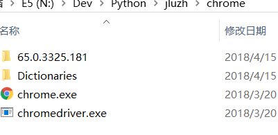
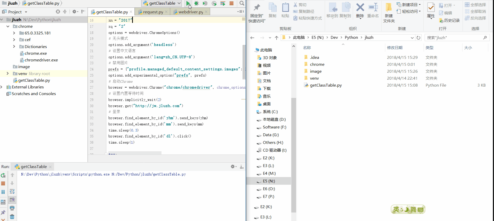

# 吉珠课表获取(1)

---
## 前言 ##

    在未特殊说明情况下,代码默认为Python3代码

虽然程序话获取课表的方式很多,但为了省事,在这里就先使用Selenium+Chrome作为辅助工具来模拟用户操作取得教务系统生成的课表PDF

我们要获取自己的课表,首先有4个变量是必须先知道的
 - 用户名(学号)
 - 密码(教务系统密码)
 - 课表的学年(例如2017)
 - 课表的学期(例如2)

## 正戏 ##
0. 安装一些必要的东西

    1. 安装一个python环境
    2. 安装selenium的pyhton包: `pip install selenium`
    3. 到[chromedriver下载页面](https://sites.google.com/a/chromium.org/chromedriver/downloads)去下载chromedriver,把chromedriver放在chrome目录下.
    4. 到[chrome下载页面(非官方)](https://api.shuax.com/tools/getchrome)下载chrome安装包并解压里面的chrome.7z到chrome目录下.
    > 3与4步骤如果无法完成可以选择直接下载我打包好的版本
    > [百度云链接: https://pan.baidu.com/s/1txU7w7N3UKtqeEfSQErTaw 密码: m9nh](https://pan.baidu.com/s/1txU7w7N3UKtqeEfSQErTaw#m9nh)

    chrome处理完后的目录图像: 

    

1. 先import必要的东西与定义那4个变量
    ```
    from selenium import webdriver
    from selenium.common.exceptions import NoSuchElementException
    import urllib.request
    import urllib.error
    import time
    
    yhm = "your_id"
    mm = "your_password"
    xn = "2017"
    xq = "2"
    ```
2. 初始化Chrome浏览器
    因为要使用Selenium+Chrome组合,所以要配置一下chrome的相关参数
    ```
    options = webdriver.ChromeOptions()
    # 无头模式
    options.add_argument('headless')
    # 设置中文语言
    options.add_argument('lang=zh_CN.UTF-8')
    # 禁用图片
    prefs = {"profile.managed_default_content_settings.images": 2}
    options.add_experimental_option("prefs", prefs)
    # 启动Chrome
    browser = webdriver.Chrome("chrome/chromedriver", chrome_options=options)
    # 设置内置等待时间
    browser.implicitly_wait(2)
    
    ```
3. 访问教务系统并模拟用户手动登录并切换到课表查询页面
    ```
    browser.get("http://jw.jluzh.com")
    # 登录
    browser.find_element_by_id('yhm').send_keys(yhm)
    browser.find_element_by_id('mm').send_keys(mm)
    time.sleep(0.3)
    browser.find_element_by_id('dl').click()
    time.sleep(1)
    
    try:
        # 切换到课表查询页面
        browser.find_element_by_xpath("//a[contains(text(),'选课')]").click()
        browser.find_element_by_xpath("//a[contains(@onclick,'xskbcx_cxXskbcxIndex')]").click()
        browser.switch_to.window(browser.window_handles[1])
        print('Login Successful')
    except NoSuchElementException:
        tips = browser.find_element_by_id('tips')
        print('Login Fail '+tips.text)
        browser.quit()
        exit(-1)
    ```
4. 获取课表
    ```
    # 查询课表
    browser.execute_script("$('#xnm1').val('" + xn + "');$('#xqm1').find(\"option:contains('" + xq + "')\").attr(\"selected\",true);searchResult1();")
    try:
        # 检查课表是否存在
        tips = browser.find_element_by_id('kblist_table')
    except NoSuchElementException:
        print('No Class Table')
    else:
        # 重写openWin函数以获得课表PDF链接
        browser.execute_script("$.openWin = function func(url){$.PDF_URL = url;};")
        browser.find_element_by_id('shcPDF').click()
        pdf = browser.execute_script("return 'http://jw.jluzh.com'+$.PDF_URL")
        try:
            # 下载课表PDF
            request = urllib.request.Request(pdf)
            request.add_header('Cookie', 'JSESSIONID=' + browser.get_cookie('JSESSIONID')["value"])  # 设置cookie
            response = urllib.request.urlopen(request)
        except urllib.error.URLError:
            print('Download Fail')
        else:
            try:
                # 写入课表PDF
                f = open(yhm + '-' + xn + '-' + xq + '.pdf', 'wb')
                f.write(response.read())
                f.close()
            except IOError:
                print('Write Fail')
            else:
                print('Get Successful')
    finally:
        browser.quit()
        
    ```

## 效果 ##
