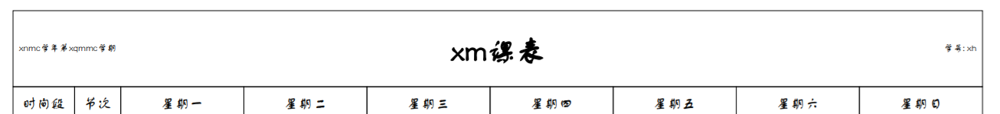
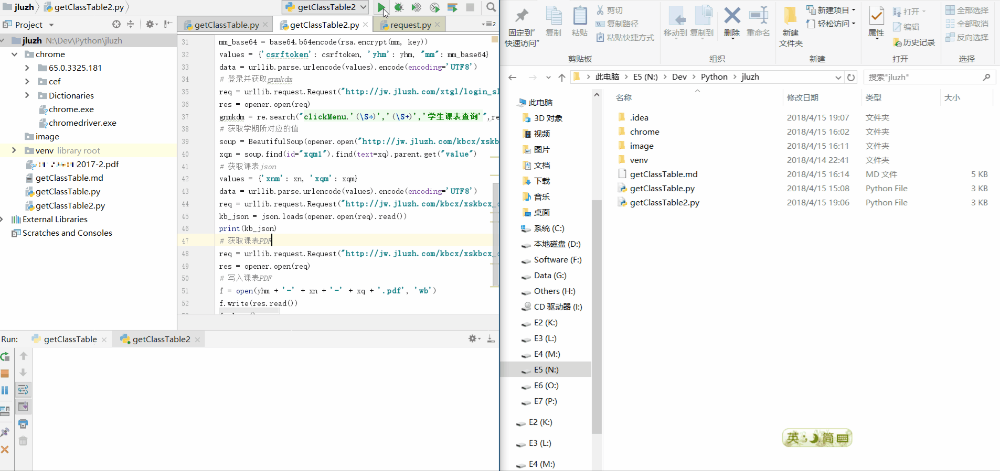

# 吉珠课表获取(2)

---
## 前言 ##

    在未特殊说明情况下,代码默认为Python3代码

为了省事,在[吉珠课表获取(1)](getClassTable.md)中使用Selenium来模拟用户在浏览器中的操作来获取,但是运行太慢,还吃内存.所以在这里改用Python的运算与链接访问来模拟用户操作获取数据,不过为了省点工,就不对异常进行处理了.

我们要获取自己的课表,首先有4个变量是必须先知道的
 - 用户名(学号)
 - 密码(教务系统密码)
 - 课表的学年(例如2017)
 - 课表的学期(例如2)

## 正戏 ##
0. 安装一些必要的东西
    1. 安装一个python环境
    2. 安装用到的的pyhton包: ```pip install beautifulsoup4 rsa```

1. 先import必要的东西与定义那4个变量
    ```
    import rsa
    import base64
    import json
    import re
    from bs4 import BeautifulSoup
    import urllib.request
    import urllib.parse
    import urllib.error
    import http.cookiejar
    
    yhm = "your_id"
    mm = b"your_password"
    xn = "2017"
    xq = "2"
    ```
    
2. 为使用cookie做点工作
    ```
    cookie_jar = http.cookiejar.CookieJar()
    opener = urllib.request.build_opener(urllib.request.HTTPCookieProcessor(cookie_jar))
    ```
    
3. 登录并获取必要的数据
    ```
    # 获取csrftoken
    soup = BeautifulSoup(opener.open("http://jw.jluzh.com/xtgl/login_slogin.html").read(),'html.parser')
    csrftoken = soup.find(id="csrftoken").get("value")
    # 获取密码加密的rsa秘钥
    key_json = json.loads(opener.open("http://jw.jluzh.com/xtgl/login_getPublicKey.html").read())
    key = rsa.PublicKey(int.from_bytes(base64.b64decode(key_json["modulus"]), byteorder='big'), int.from_bytes(base64.b64decode(key_json["exponent"]), byteorder='big'))
    # 构造登录POST所需的数据
    mm_base64 = base64.b64encode(rsa.encrypt(mm, key))
    values = {'csrftoken': csrftoken, 'yhm': yhm, "mm": mm_base64}
    data = urllib.parse.urlencode(values).encode(encoding='UTF8')
    # 登录并获取gnmkdm
    req = urllib.request.Request("http://jw.jluzh.com/xtgl/login_slogin.html", data)
    res = opener.open(req)
    gnmkdm = re.search("clickMenu.'(\S*)','(\S+)','学生课表查询'",res.read().decode('utf-8')).group(1)
    # 获取学期所对应的值
    soup = BeautifulSoup(opener.open("http://jw.jluzh.com/kbcx/xskbcx_cxXskbcxIndex.html?gnmkdm=N253508").read(),'html.parser')
    xqm = soup.find(id="xqm1").find(text=xq).parent.get("value")
    ```

4. 获取课表
    这里可以选择获取课表的json数据,然后解析成自己想要格式;也可以直接下载教务系统生成的PDF
    1. 获取JSON版本
        ```
        values = {'xnm': xn, 'xqm': xqm}
        data = urllib.parse.urlencode(values).encode(encoding='UTF8')
        req = urllib.request.Request("http://jw.jluzh.com/kbcx/xskbcx_cxXsKb.html?gnmkdm="+gnmkdm, data)
        kb_json = json.loads(opener.open(req).read())
        print(kb_json) # 这里仅仅输出,不做解析
        ```
    2. 获取PDF版本
        PDF版本实际上是教务系统根据URL的参数进行生成的,可以根据需求自行改动

        | 参数      | 解释                   | 备注                      |
        | --------- | ---------------------- | ------------------------- |
		| xnm       | 用作查询数据的学年信息 | 教务系统查询用,不要改     |
        | xqm       | 用作查询数据的学期信息 | 教务系统查询用,不要改     |
        | xszd.sj   | 是否显示周数           | 设为true或false           |
        | xszd.cd   | 是否显示上课地点       | 设为true或false           |
        | xszd.js   | 是否显示教师           | 设为true或false           |
        | xszd.jszc | 是否显示教师职称       | 设为true或false           |
        | xszd.jxb  | 是否显示教学班         | 设为true或false           |
        | xnmc      | PDF显示的学年          | |
        | xqmmc     | PDF显示的学期          | |
        | xm        | PDF显示的姓名          | |
        | jgmc      | 未知                   | 在生成PDF过程中疑似被忽略 |
        | xxdm      | 未知                   | 在生成PDF过程中疑似被忽略 |
        | xh        | PDF显示的学号          | |
        | xh_id     | 用作查询数据的学号信息 | 教务系统查询用,不要改     |
        
        生成的课表表头:
        
        
        现在为了省事,代码中参数按简单的方式设定
        ```
        # 获取课表PDF
        req = urllib.request.Request("http://jw.jluzh.com/kbcx/xskbcx_cxXsShcPdf.html?doType=table&xnm="+xn+"&xqm="+xqm+"&xszd.sj=true&xszd.cd=true&xszd.js=true&xszd.jszc=false&xszd.jxb=true&xnmc="+xn+"&xqmmc="+xq+"&xm=&jgmc=&xxdm=&xh="+yhm+"&xh_id="+yhm+"&gnmkdm="+gnmkdm)
        res = opener.open(req)
        # 写入课表PDF
        f = open(yhm + '-' + xn + '-' + xq + '.pdf', 'wb')
        f.write(res.read())
        f.close()
        ```
        
## 效果 ##

